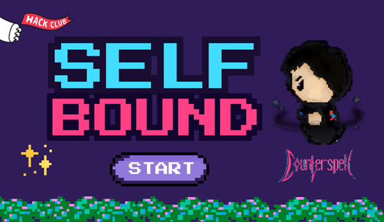

# Selfbound

Selfbound is a dungeon crawler where you fight past versions of yourself. Every enemy is a copy of how you played in previous runs, so you must adapt and outsmart your own past strategies. 

## How to play
- Earn coins by defeating enemies.
- Buy upgrades with coins to get stronger, although enemies will mimic your strength.
- Complete the game by beating the final boss!

## Controls
- WASD: Move around
- Mouse Hover: Aim
- Space: Shoot
- Other Keys: Activate abilities (specific mappings may vary)


## Demo




## Installation
### Requirements
- Python 3.0+
- Pygame

### Setup
Install Pygame using pip:
```sh
pip install pygame
```

## Replit (no sound)
- https://replit.com/@michaelzjqu/CounterSpell

## Credits
This project was made in collaboration with [Michael Qu](https://github.com/MichaelZjQu) and Linda Qi.  
